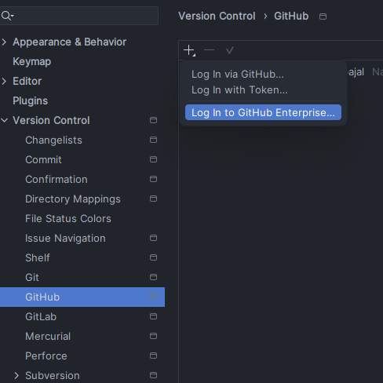
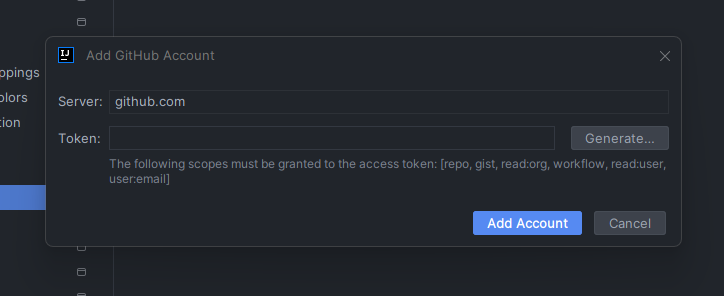

# Despliegue de Aplicaciones Spring Boot en Render


## Despliegue de Aplicaciones Spring Boot en Render
* Guía detallada para desplegar aplicaciones desarrolladas con Spring Boot en Render, utilizando Git, 
GitHub e IntelliJ IDEA. Aprende paso a paso cómo configurar y lanzar tu aplicación en la nube de Render de 
manera eficiente y segura.

## Tecnologías Utilizadas
* Java, Spring Boot: Desarrollo de aplicaciones web backend.
* Git, GitHub: Control de versiones y gestión de repositorios.
* IntelliJ IDEA: IDE para desarrollo de aplicaciones Java.
* Render: Plataforma de despliegue en la nube con soporte para contenedores Docker.
## Pasos para realizar el Despliegue

1. [Crear una cuenta en Render](https://render.com/)
2. [Instalar y configurar Git en tu ordenador](https://www.git-scm.com/)
3. [Crear una cuenta en GitHub y el repocitorio](https://github.com/)

Una vez que tengas estos tres pasos completados, vamos a configurar Git y GitHub con IntelliJ IDEA. Si no tienes 
la versión Ultimate del programa, deberás crear un repositorio primero y después vincular el repositorio 
con IntelliJ IDEA para realizar la sincronización de los archivos.

# Configuracion de GitHub y IntelliJ IDEA

Realiza los siguientes pasos para la conexión de IntelliJ IDEA y GitHub. Si no tienes la versión Ultimate del programa, 
sigue los pasos: Configuración > Control de versiones > GitHub > presiona en el botón más para agregar una cuenta.




Tienes dos formas para realizar el vínculo del servicio:

* Con Log in via GitHub: te mandara al navegardor para vincular la cuenta.


* Con Log in via Token: Tienes que generar tu token que se encuentra en tu GitHub.



* Presiona Generate para que puedas generar tu token para vincular tu cuenta. 

# Configuracion de Git y IntelliJ IDEA
En la barra de menú, escogemos la opción de VCS > Create Git Repository > escoge el archivo que vas a subir a Git, 
después te diriges al siguiente apartado.


Selecciona **Changes** para subir los archivos. Antes de subir los archivos, verifica si los archivos por subir son los 
correctos o si te falta alguno. Lo puedes modificar en el archivo **.gitignore**. Una vez configurado, estamos listos para 
realizar el commit del archivo y subirlo a Git y GitHub.

Una vez que hayas realizado el commit, vamos a vincular el repositorio de GitHub con IntelliJ IDEA.


* Escoges la opcion **Difene remote**.
* Colaca el nombre de tu repositorio.
* Coloca la **URL** de tu repositorio que creaste al pricipio.


Después de eso, vamos a [Render](https://render.com/) para realizar el vínculo del servicio con GitHub.


En Render, escogemos la opción de **Web Service** para subir el repositorio del archivo.


Nos dirigimos a la opción de Public Git Repository, colocamos la URL del repositorio y presionamos Connect para comenzar.

* Colocamos los datos que nos piden: nombre, región y branch. Todas estas opciones son a elección propia.
* En la opción de Runtime, escogemos Docker para la creación.
* En la opción Instance Type, escogemos la Free, también es decisión propia.


* Si presionas Generate, no cargará porque falta un archivo de configuración.

* Si se sube el archivo sin el archivo Dockerfile, no correrá el programa. Sigue los siguientes pasos para crear 
el archivo de Docker.
* Para crear un archivo Dockerfile, realiza esto en la carpeta raíz de tu proyecto. Tu archivo Dockerfile debe
* tener los siguientes parámetros:

```dockerfile
FROM amazoncorretto:22-alpine-jdk

COPY target/Spring-deploy-1.0.jar app.jar

ENTRYPOINT ["java",  "-jar", "./app.jar"]
```
* La versión de Java utilizada para crear el proyecto es la versión 22, que se usará para crear la imagen en Docker.
* Después, el archivo utilizará el .jar para correr el proyecto.
* Le permite configurar un contenedor que se ejecutará como ejecutable.

Para la creación del .jar, lo puedes realizar por consola del sistema operativo o desde el mismo IntelliJ IDEA.

Sigue los siguientes pasos para realizar el .jar con IntelliJ IDEA:
* Escoge el botón de Maven > selecciona el archivo > Lifecycle > Clean > package.
* Después de eso, se generará el .jar en la carpeta target con el número de versión y el nombre del archivo.
* Sube los archivos a GitHub para que Render detecte el cambio y realice el despliegue.

Nota: Cada cambio que se realice debe limpiarse y generarse el package para que no tengas problemas 
al cargar nuevos archivos a Render.

* Una vez subido, Render empezará a realizar el despliegue de tu proyecto.


* Cuando Render termine el proceso, en la consola figurará el siguiente mensaje indicando que ya está 
listo para utilizarse.


* Cuando esté listo, en la parte superior de Render aparecerá el link para que lo utilices y pruebes.
* Prueba tus entradas que realizaste y asegúrate de que todo esté bien para que no tengas problemas al usar tu proyecto. 


## Autor
[Giancarlos Yanayaco](https://github.com/NaiGO4)


## Licencia

Este proyecto no tiene una licencia específica. Si tienes preguntas sobre el uso o distribución de este código, 
por favor contacta al autor.

## Nota Final
Este es mi primer README.md, espero que les ayude a implementar sus proyectos con Render. Es algo complicado si no lo
conoces, pero con el tiempo sabrás por dónde ir y el despliegue se vuelve sencillo.

